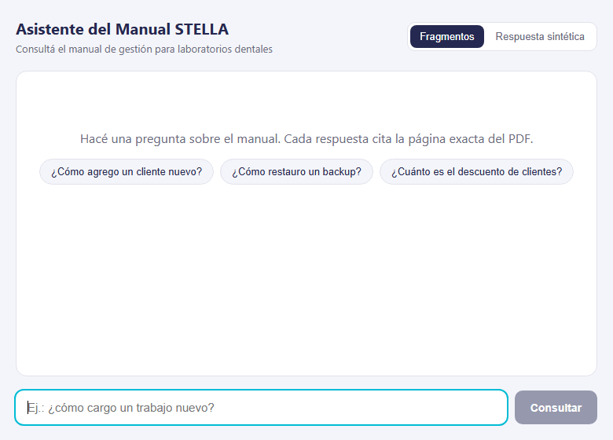

# Rag-Proyectos

Asistente RAG multi-documento sobre la documentación de los proyectos del
portafolio. Responde preguntas sobre el *manual de STELLA* con citas de página
navegables; con el tiempo cada proyecto nuevo (SolutionsCars, Oak,
Butterflies…) agrega su propio documento al corpus sin rediseñar nada.

**En producción** (fases 0–7 completadas):

- Directo: <https://rag-proyectos.vercel.app>
- Desde el portafolio (mismo dominio):
  <https://portafolio-web-three-gamma.vercel.app/asistente/>



## Cómo funciona

```
Pregunta → FAISS (embeddings ONNX locales) + BM25 → RRF → top-k
         → gate anti-relleno (score BM25 < 2 → sin respuesta)
         → modo fragmentos (citas, 0 tokens)  ─┐
         → modo sintética (respuesta Groq)    ─┴→ UI con chips "p. N"
```

- **Retrieval local**: BM25 corre siempre; el canal denso (FAISS +
  `fastembed`, ONNX) es **opcional** y su modelo pesa ~640 MB descargados —
  sin torch y sin llamadas externas, pero **no entra en un cold start de
  Vercel de 60s**: en producción corre BM25 + gate (ver `RAG_DENSE`).
- **Generación opcional**: si hay `LLM_API_KEY` (Groq, API compatible con
  OpenAI, con reintentos ante 5xx) redacta la respuesta con las citas; si no —
  o si falla — responde con los fragmentos crudos y sus páginas. El asistente
  **nunca queda roto**.
- **Citas navegables**: cada respuesta muestra `📄 Manual STELLA, p. N` y la
  UI abre `manual-stella.pdf#page=N`.

## Stack

| Capa | Tecnología |
|------|------------|
| API | FastAPI + SSE (`/api/chat`), Swagger en `/docs` |
| Retrieval | Híbrido: FAISS + BM25 + RRF (portado de `instructor-LSA`) |
| Embeddings | `jinaai/jina-embeddings-v2-base-es` (768d) vía fastembed (ONNX) |
| Generación | Opcional: Groq (compatible OpenAI) por env vars `LLM_*` |
| UI | React 19 + Vite 8 + oxlint (ES, sin TypeScript) |
| Tests | pytest (49 tests API/retrieval + gold set de 12 preguntas ES) |
| CI | GitHub Actions: pytest con `uv sync --frozen` + oxlint + build del cliente |
| Deploy | Vercel: services `web` + `api` en un proyecto + proxy del portafolio |

## Estructura

```
corpus/     fuentes y PDFs (manual-stella.pdf)
data/       índice FAISS + chunks (commiteado, reindexable)
scripts/    md2pdf + ingest (page-aware)
rag/        motor: loader, chunker, embeddings, BM25, RRF, RAGService
app/        FastAPI: /api/health, /api/chat (SSE), /api/search, rate limit
api/        wrapper ASGI de Vercel (normaliza /asistente/api/*)
tests/      pytest: API + retrieval (gold set)
client/     React: chat con chips de cita, ES-only en v1
docs/       GIF del README
.github/    CI
```

## Desarrollo

```bash
# API (Python 3.12+)
uv sync --frozen                # crea .venv desde uv.lock (o: pip install -r requirements.txt)
uv run uvicorn app.main:app --reload     # http://localhost:8000

# UI
cd client
npm install
npm run dev        # http://localhost:5173 (proxy /api -> :8000)

# Tests (0 tokens)
uv run pytest
```

## Variables de entorno

Ver `.env.example`:

| Var | Rol |
|-----|-----|
| `LLM_API_KEY` | clave Groq; nunca commiteada; si falta → modo fragmentos |
| `LLM_BASE_URL` | OpenAI-compatible (default: `https://api.groq.com/openai/v1`) |
| `LLM_MODEL` | default `qwen/qwen3.8-27b` (tope free: 1000 tokens de salida/min) |
| `LLM_TIMEOUT` | presupuesto total de reintentos en segundos (default `45`) |
| `RAG_DENSE` | `0` (default en Vercel) apaga el denso; `1` lo fuerza — pero jina-v2-es pesa ~640 MB y no baja en un cold start de 60s |
| `FASTEMBED_CACHE_PATH` | caché de descarga del modelo (en Vercel, `rag/config.py` la fuerza a `/tmp`) |

## Deploy (Vercel)

`vercel.json` usa el modo **services**: un proyecto con dos servicios.

| Servicio | Raíz | Qué sirve |
|----------|------|-----------|
| `web` | `client/` | UI Vite con `VITE_BASE=/asistente/`; rewrite interno `/asistente/(.*)` → `/$1` |
| `api` | `.` | FastAPI vía `api/rag_api.py` (wrapper ASGI, `maxDuration` 60) |

Rewrites del proyecto, en orden: `/asistente/api/*` → `api`, `/api/*` →
`api`, `/asistente/*` → `web`, `/*` → `web`.

Detalles que importan:

1. **El wrapper `api/rag_api.py` normaliza el prefijo**: las rutas
   `/asistente/api/chat` llegan como tal y se reescriben a `/api/chat` en
   ASGI antes de que FastAPI enrute (el `request.path` transform de services
   no se aplicó; se resolvió en el wrapper, con tests).
2. **uv en el build**: Vercel ejecuta `uv lock`, que exige `[project]` en
   `pyproject.toml`; `uv.lock` está commiteado.
3. El `prebuild` de `client/` copia `corpus/*.pdf` a `client/public/corpus/`,
   así las citas `#page=N` abren el PDF desde el CDN.
4. Env vars en el dashboard **con scope Production** (las de Preview no
   aplican al dominio de producción): `LLM_API_KEY`, `LLM_BASE_URL`,
   `LLM_MODEL` y `RAG_DENSE=0` (denso apagado: el modelo de 640 MB no baja
   en el cold start; el híbrido queda para una máquina con caché o un
   modelo cuantizado chico, ver roadmap).
5. `/api/health` expone `status` (`ok`/`degraded`), `retrievable` (índice y
   chunks presentes), `llm` (key presente), `model`, `dense` y
   `dense_error` (último fallo del canal denso, con rutas saneadas), para
   saber en caliente si el denso cayó a BM25 y por qué.
6. El aviso de build *"`api/` directory will not be built because services
   are configured"* es **esperado** con el modo services: `api/` entra por el
   rewrite, no como build standalone.
7. Nunca roto: sin key → fragmentos; sin modelo → BM25; query ajena al
   manual → "no encontré nada" (gate de score); sin índice → 503 claro en la
   API (los tests lo cubren).
8. **Proxy del portafolio** (repo `Portafolio-web`): su `client/vercel.json`
   manda `/asistente/*` a `https://rag-proyectos.vercel.app/*`, y la ficha
   STELLA tiene el botón **🤖 ASISTENTE RAG** que entra por ahí.
9. **Headers de seguridad** (ambos `vercel.json`): en el RAG, CSP estricta
   (`script-src 'self'`, sin hosts externos) + `nosniff`, `SAMEORIGIN`,
   `Referrer-Policy` y `Permissions-Policy`; el portafolio lleva las mismas
   sin CSP (usa Google Fonts).
10. **Límites y errores**: rate limit en memoria por IP (10/min chat,
    60/min search → 429 con `Retry-After`), circuito ante 429s de Groq
    (3 en 60s → degrada sin llamar al proveedor), 429 del LLM se reintenta
    solo si `Retry-After` cabe en el presupuesto, y todo error viaja al
    cliente como `reason` de la enumeración (`no_key | rate_limited |
    timeout | interrupted | upstream | error`) — nunca `str(exc)` (los 503
    llevan solo un `error_id` de 8 caracteres en el log).

## Roadmap

| Fase | Entregable | Estado |
|------|------------|--------|
| 0 | Andamiaje: FastAPI + React + CI + tests | ✅ |
| 1 | Manual STELLA (40-60 pág) + PDF + ingest page-aware | ✅ |
| 2 | Motor híbrido (FAISS+BM25+RRF) + gold set | ✅ |
| 3 | `/api/chat` SSE + modos `fragmentos`/`sintetica` | ✅ |
| 4 | UI React: chat + chips de cita `p. N` | ✅ |
| 5 | Deploy Vercel | ✅ |
| 6 | README final + GIF demo | ✅ |
| 7 | Link desde el portafolio (botón en ficha STELLA) | ✅ |
| 8 | LLM Groq + anti-relleno (stopwords, gate, snippet) + health con flags | ✅ |
| 9 | Hardening: rate limit, errores saneados, cancelación en la UI, headers, CI con uv/oxlint/build | ✅ |
| fut. | Modelo de embeddings cuantizado bundleado → denso en Vercel | ⬜ |
| fut. | Nuevos documentos (otros proyectos) + upload PDFs | ⬜ |
